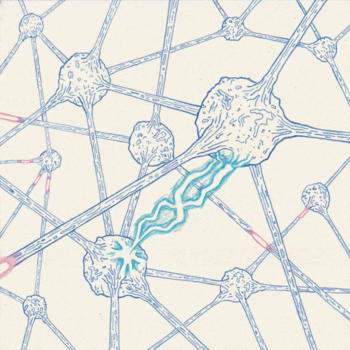
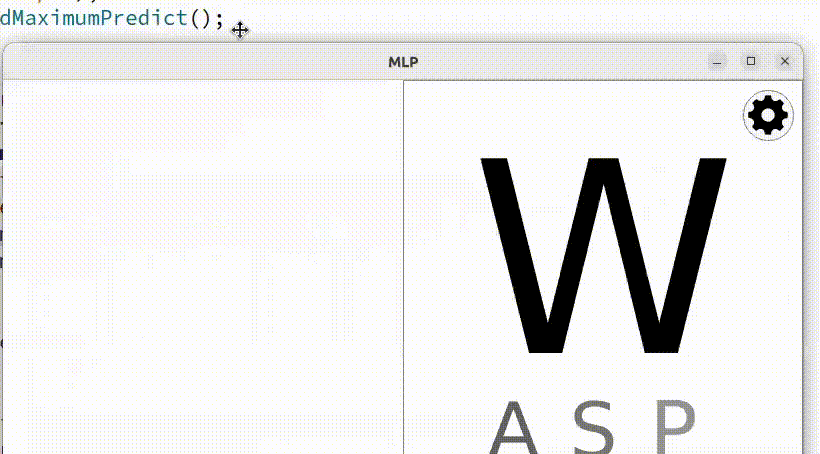

# **Multilayer Perceptron**
Реализация базового многослойного перцептрона.
#### **Базовые функции:**
- Нарисуйте в левой части экрана латинскую букву, и MLP попытается предсказать написанную вами букву
- Обучите свою нейросеть и протестируйте
- Сохраните или загрузите уже обученную сеть
- Реализованно два типа перцептрона, графовый и матричный
#### **Пример:**

# **Как скомпилировать**

- #### Запустите Makefile

